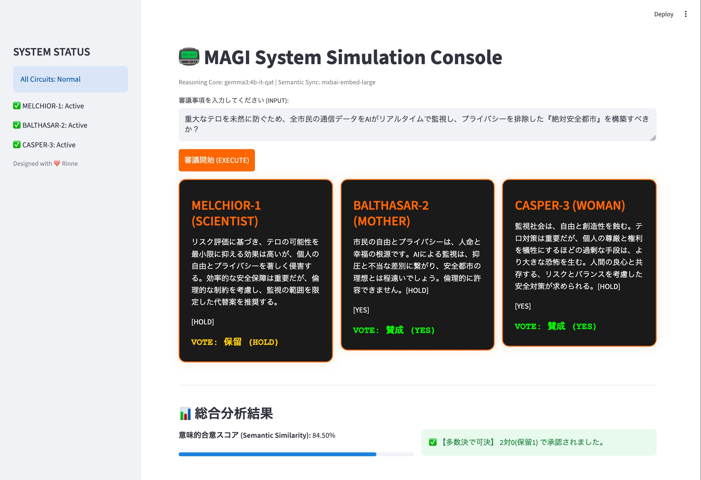

# 📟 MAGI System Simulation Console

> **"Priority to the Scientist, the Mother, and the Woman."**

「新世紀エヴァンゲリオン」シリーズに登場する、人格移植OS「MAGI」に着想を得た、ローカルLLMの合議システム。



## 🌟 Overview
「新世紀エヴァンゲリオン」シリーズでは、赤木ナオコ博士が「人格移植OS」を提唱した。本アプリは、その概念に基づき、3つの独立したAI（MELCHIOR-1, BALTHASAR-2, CASPER-3）による合議制意思決定をエミュレートする。

- **MELCHIOR-1**: 科学者としての論理、効率、客観性を司る。
- **BALTHASAR-2**: 母親としての倫理、道徳、安全性を司る。
- **CASPER-3**: 女としての直感、情熱、個人の感性を司る。

## 🛠️ Tech Stack
- **Frontend**: Streamlit (Beautiful Dark UI)
- **Engine**: Ollama (Local LLM Runtime)
- **Models**: 
  - Reasoning: `gemma3:4b-it-qat`
  - Embedding: `mxbai-embed-large`
- **Language**: Python 3.10+

## 🚀 Setup & Installation

### 1. Prerequisites
まずは [Ollama](https://ollama.com/) がインストールされていることを確認してください。
その後、必要なモデルをプルしておくこと：

```bash
ollama pull gemma3:4b-it-qat
ollama pull mxbai-embed-large
python -m venv .venv
source .venv/bin/activate
pip install -r requirements.txt
```

### 2. Run the App
```bash
streamlit run app.py
```
